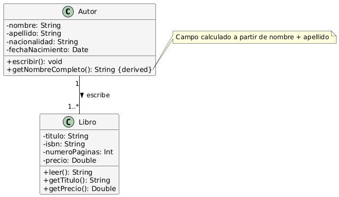
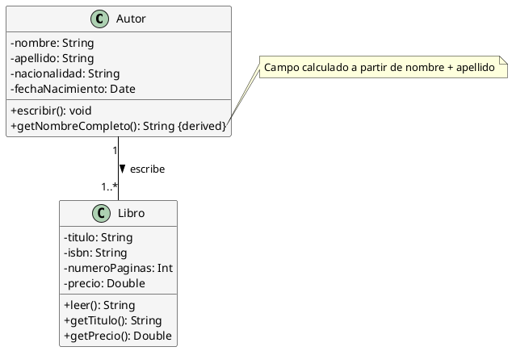

# Solución: Ejercicio 1 - Sistema de Libros y Autores

## Análisis del Problema

### Identificación de Clases

Se pueden identificar las siguientes clases:

1. **Autor**
    - Representa al autor que escribe libros
    - Atributos: nombre, apellido, nacionalidad, fechaNacimiento
    - Métodos: escribir(), getNombreCompleto()

2. **Libro**
    - Representa un libro que puede ser leido
    - Atributos: titulo, isbn, numeroPaginas, precio
    - Métodos: leer(), getTitulo(), getPrecio()

## Análisis de relaciones

### Autor - Libro

- **Nombre**: "escribe"
- **Tipo**: Asociacion 
- **Cardinalidad**:
    - Un autor escribe 1..* Libros (minimo 1, sin máximo)
    - Un libro tiene 1 autor
- **Justificacion**: El libro necesita un autor para poder ser escrito, y el autor mínimo necesita haber escrito un libro para poder considerarse autor

## Tabla de Roles y Cardinalidades
| Relacion | Clase Origen | Rol Origen | Cardinalidad Origen | Clase Destino | Rol Destino | Cardinalidad Destino |
|----------|--------------|------------|---------------------|---------------|-------------|---------------------|
| Asociacion | Autor | escribe | 1..* | Libro | escritoPor | 1 |

## Decisiones de Diseño

### ¿Porque se usa Asociacion?
Se usa la relacion de **asociacion** ya que un libro no puede existir sin un autor, ya que aunque sea un autor anónimo, tiene un autor. Por otro lado, un Autor necesita haber escrito un libro para ser autor, ya que sino no lo sería.

## Diagrama de Clases

## Código PlantUML

## Implementacion en Kotlin
/**
    * Clase que representa un Autor
    */
open class Autor(
    private val nombre: String,
    private val apellido: String,
    private val nacionalidad: String,
    private val fechaNacimiento: Date
){
    open fun escribir(){
        println("$nombre $apellido)
    }
}